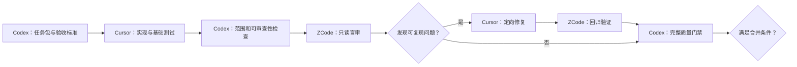

# AI 多工具协作规范

本规范定义 Codex、Cursor 和 ZCode 在本仓库中的职责、交接方式与质量门禁。目标是利用独立实现与独立审查降低遗漏，而不是让多个工具同时修改同一份代码。

`AGENTS.md`、架构文档、ADR、路线图、任务验收条件、Git diff 和可重复执行的测试结果是共同事实来源。任何聊天记录或代理的自我评价都不能替代这些仓库内证据。

## 1. 协作原则

1. **单一实现者**：一个任务或 PR 只能指定一个主实现者。
2. **工作区隔离**：不同工具不得同时修改同一分支或同一 working tree；需要并行时使用独立分支和 `git worktree`。
3. **先验收、后实现**：Codex 在派发任务前必须写清范围、非目标和可验证的验收条件。
4. **独立审查**：ZCode 首轮审查不读取 Cursor 的推理或聊天过程，只读取任务包、仓库规范、代码 diff 和测试结果。
5. **证据优先**：完成声明必须由测试、静态检查、可复现步骤或具体代码证据支持。
6. **最小变更**：实现、审查和修复均不得顺手重构任务范围外的代码。
7. **人工控制高风险决策**：新增付费服务、真实密钥、生产部署、数据删除、对外发布或明显扩大范围时，必须由用户确认。

## 2. 角色与责任

| 角色 | 主要责任 | 不应承担 |
| --- | --- | --- |
| Codex：架构与集成 | 拆分任务、定义验收、维护规范与 ADR、派发任务、检查 diff 和测试有效性、运行完整质量门禁、判断是否达到合并条件 | 在已指定 Cursor 为主实现者时并行修改相同文件；用自我评价代替验证 |
| Cursor：主开发 | 在独立功能分支实现需求、编写基础单元测试、更新受影响文档、执行开发期检查并提交交接报告 | 未经确认改变架构边界、扩大需求、修改审查分支或跳过失败测试 |
| ZCode：独立测试与审查 | 根据需求和验收条件做盲审，复现问题，检查边界、安全、恢复、引用和不确定性；经 Codex 接受问题后可在独立分支补充失败测试 | 首轮直接重写实现；仅凭风格偏好提出大范围重构；把 Goal Mode 的完成判断当作质量证明 |

Codex 是集成责任人：只有 Codex 确认验收条件、审查问题和质量门禁均已处理，变更才具备合并资格。GitHub 权限、分支保护和用户指令仍是最终约束。

## 3. 标准任务包

Codex 派发给 Cursor 或 ZCode 的任务必须包含以下内容：

```text
任务名称：
目标：
主实现者 / 审查者：
基线分支和目标分支：
范围内：
范围外：
相关规范和 ADR：
验收条件：
必须覆盖的测试：
安全、成本和兼容性约束：
必须运行的命令：
交付物：
```

验收条件必须描述外部可观察行为，例如“达到最大步数后返回 `max_steps` 终止原因”，不能只写“完善循环”或“增加健壮性”。

## 4. 分支和工作区隔离

- Codex 创建或确认任务分支后，才允许主实现者开始工作；
- AI 主开发分支沿用 `agent/<short-description>`；
- ZCode 只读审查可以直接基于 PR diff；需要补测试时使用独立的 `agent/review-<short-description>` 分支或独立 worktree；
- 同一时刻不得让 Cursor、ZCode 和 Codex 在同一 working tree 自动编辑；
- 任何工具开始工作前都必须运行 `git status --short --branch`，不得覆盖未知改动；
- 交接以 commit SHA、Git diff 和测试结果为准，不依赖未入库的本地上下文；
- 禁止代理自动执行强推、历史改写、远程分支删除和绕过分支保护的操作。

## 5. 执行流程



### 5.1 Cursor 实现交接

Cursor 完成实现后必须报告：

- 当前分支和 commit SHA；
- 修改文件及其目的；
- 新增或更新的测试；
- 实际运行的命令和结果；
- 已知限制、未验证项和风险；
- 是否改变依赖、配置、数据结构或外部接口。

### 5.2 ZCode 两阶段审查

第一阶段默认只读，不修改代码。每个问题必须包含：

- 严重级别：P0 阻断、P1 高、P2 中、P3 低；
- 对应的验收条件或风险；
- 文件和最小代码位置；
- 可复现输入、失败表现和预期表现；
- 建议增加的测试；
- 证据不足时明确标记为“待验证”，不得当成已确认缺陷。

Codex 先判断问题是否有效、是否在范围内。只有被接受的问题才进入第二阶段，由 ZCode 在独立分支补充失败测试，或交回 Cursor 修复。ZCode 补充的测试必须能在修复前失败、修复后通过；无法做到时要说明原因。

### 5.3 Codex 最终验收

Codex 必须检查：

1. diff 是否严格符合任务范围和架构边界；
2. 测试是否断言关键行为，而不是只验证代码能够运行；
3. ZCode 的有效问题是否全部关闭或有明确接受风险；
4. 文档、依赖、配置和行为是否一致；
5. `AGENTS.md` 中的完整质量门禁是否通过；
6. 是否存在密钥、隐私数据、生成文件或无关改动；
7. PR 是否记录验证结果、限制、安全和成本风险。

## 6. 何时启用双角色或三角色

不是所有任务都需要三个工具。默认策略如下：

| 风险 | 示例 | 流程 |
| --- | --- | --- |
| 低 | 文档、注释、确定性的小型 Demo | Cursor 或 Codex 实现，Codex 验收 |
| 中 | Agent 循环、状态转换、序列化、依赖或公开接口变化 | Cursor 实现，ZCode 针对关键边界审查，Codex 验收 |
| 高 | 外部网络、工具执行、私网访问、Python 沙箱、恢复、并发、成本、训练奖励、引用评估 | Cursor 实现，ZCode 完整盲审和回归，Codex 验收 |

以下情况必须启用三角色流程：

- 处理不可信网页内容、URL、文件或模型生成代码；
- 引入真实 Search、Visit、Scholar 或 Python 执行能力；
- 修改预算、重试、超时、取消、缓存或恢复语义；
- 修改来源去重、引用映射、评估 Judge 或奖励函数；
- 引入并发、持久化、外部服务、付费 API 或生产部署配置。

## 7. ZCode 重点审查清单

### Agent 边界

- 最大步数、最大耗时、Token 和成本预算是否都能终止；
- 正常完成、预算耗尽、用户取消和内部错误是否有不同终止原因；
- 循环是否可能无进展、重复调用或提前声称完成。

### 工具和安全

- 超时、可重试/不可重试错误、退避、降级和缓存是否正确；
- Prompt Injection 是否被当作不可信数据处理；
- Visit 是否阻止非 HTTP(S) 协议、私网地址、危险重定向和超大响应；
- Python 是否限制网络、文件、进程、CPU、内存和执行时间；
- 搜索为空、字段缺失、畸形响应和服务不可用是否可处理。

### 状态和恢复

- 状态能否稳定序列化并保持 schema 兼容；
- 工具调用前后检查点是否避免昂贵操作重复执行；
- 中断、超时和进程重启后是否从正确位置恢复；
- 部分写入、重复事件和过期检查点是否安全处理。

### 来源、引用和评估

- 报告事实是否由对应来源支持，而不只是存在链接；
- 缺失引用、重复 URL、同源不同 URL 和互相冲突的来源是否处理；
- 无可靠依据时是否明确表达不确定性；
- Judge、评分标准、数据集和模型版本是否可复现；
- 是否存在为了指标得分而损害真实质量的行为。

## 8. 工具调度前置条件

Codex 只有在本机存在稳定、可验证的命令或集成入口时，才能直接调度 Cursor 或 ZCode。开始调度前必须：

1. 检查命令是否存在并记录版本；
2. 确认工具能够打开指定仓库、分支或独立 worktree；
3. 限制工具可修改的范围和允许执行的命令；
4. 保存任务包、commit SHA 和最终结果，避免只保留在聊天界面；
5. 先用低风险任务试运行，再开放自动编辑或长任务模式。

如果只有图形界面、没有 Codex 可调用的接口，则由 Codex 生成标准任务包、用户在对应工具中启动任务。这属于“人工交接”，不得描述为自动调度。

## 9. 协作效果复盘

前两个功能 PR 记录以下数据，第三个 PR 前决定是否继续固定三工具流程：

- 首轮验收通过率；
- ZCode 新发现且可复现的缺陷数；
- 审查误报和范围外建议数；
- 从派发到合并的总耗时；
- 修复轮数、冲突数和额外成本；
- 逃逸到 Codex 最终验收或 CI 的问题数。

如果 ZCode 未发现新增有效问题，或协作成本持续高于收益，则降级为按风险触发；如果安全、恢复或引用缺陷发现率明显提升，则在第 3、4、7、8 章保持三角色流程。
