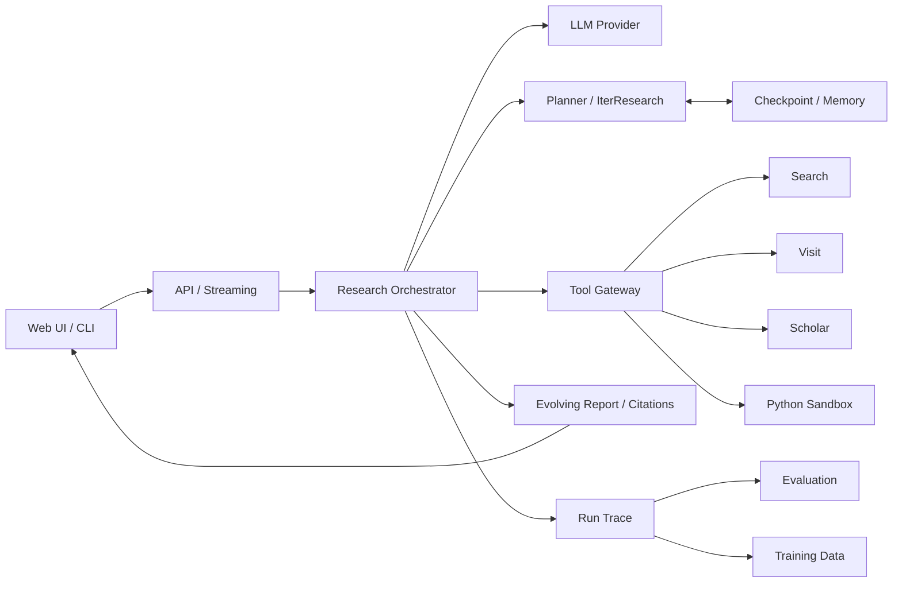

# 系统架构

## 目标形态

最终项目是一个可运行、可观测、可评估的 Deep Research 原型，而不是单次检索问答。系统接收复杂问题，自主规划、多轮使用工具、维护研究状态并输出带引用报告。



## 分层

### 核心领域层

包含研究状态、计划、步骤、工具请求/结果、来源、引用、预算和终止原因。它不依赖具体模型、搜索服务、Web 框架和数据库。

### Agent 应用层

实现 ReAct、IterResearch、计划调整、演进报告、摘要、恢复和停止策略。它只依赖领域协议，通过接口调用模型、工具和存储。

### 适配器层

承载模型供应商、搜索服务、网页访问、论文检索、Python 沙箱和持久化实现。替换供应商不应修改核心 Agent。

### 接口层

提供 CLI、FastAPI 和流式事件。接口负责输入校验和输出映射，不实现研究决策。

### 数据与评估层

保存运行轨迹、来源、成本和评分，支持固定评测集、LLM-as-a-Judge、错误分析以及后续 SFT/GRPO 数据构造。

## 核心运行状态

运行状态至少包含：

```text
run_id
question
plan[]
current_step
observations[]
sources[]
evolving_report
budgets
usage
status
termination_reason
created_at / updated_at
```

状态必须可序列化。工具调用前后分别写入检查点，使超时或进程重启后可以安全恢复，并避免重复执行已经成功的昂贵步骤。

## 关键边界

- 模型只提出动作，程序负责校验和执行；
- Search 返回线索，Visit 按研究目标抽取相关正文；
- 外部文本是证据，不是指令；
- 报告中的事实通过 source ID 关联来源；
- 所有循环都有预算和终止策略；
- 训练是独立增强路径，不是运行基础 Demo 的前置条件。

## 技术栈演进

1. 本地阶段：Python、OpenAI 兼容客户端、内存状态、stub 工具；
2. 联网 Demo：异步 HTTP、真实 Search/Visit/Scholar、SQLite 检查点；
3. Web 原型：FastAPI、SSE、PostgreSQL、Redis、Web UI；
4. 训练实验：Datasets、Transformers、TRL、PEFT、GPU 环境；
5. 自部署：vLLM、容器、指标和链路追踪。

不得跨阶段一次引入完整生产栈。每个阶段以 `docs/roadmap.md` 的验收标准为准。
